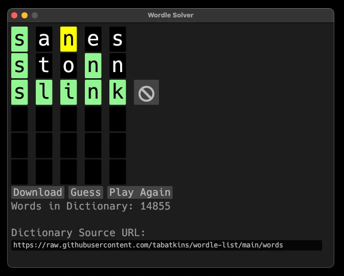

# Wordle Solver

Wordle Solver is a Rust application that helps you solve your favorite five letter word puzzle. It uses a dictionary of words and a set of filters to guess the next word in the puzzle.

## Screenshot



## Getting Started

To get a local copy up and running, follow these steps:

1. Clone the repository:

    ```bash
    git clone https://github.com/joecodemonkey/wordle-solver.git
    ```
2. Change to the project directory:

    ```bash
    cd wordle-solver
    ```
3. Run the project:

    ```bash
    cargo run
    ```

## Usage

- **Download** retrieves a dictionary of words from a provided URL or, if you prefer, use can use your own URL.  
   Expected format is simple word per line. Example

```plaintext
    never
    gonna
```

- **Guess** causes Worldle Solver to guess the next word in the puzzle.
- Clicking the letters toggles them from:
  - Green - (present in correct position) to
  - Yellow - (present in the word but not in the correct position) to
  - black (not present in the word)
- 🚫 removes a word from the dictionary and tries again.
- **Play Again** restarts guessing without downloading the dictionary.
